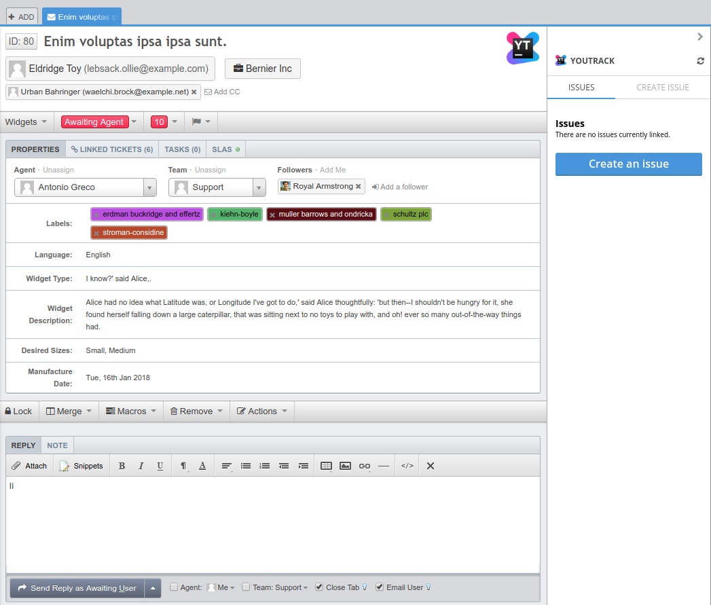
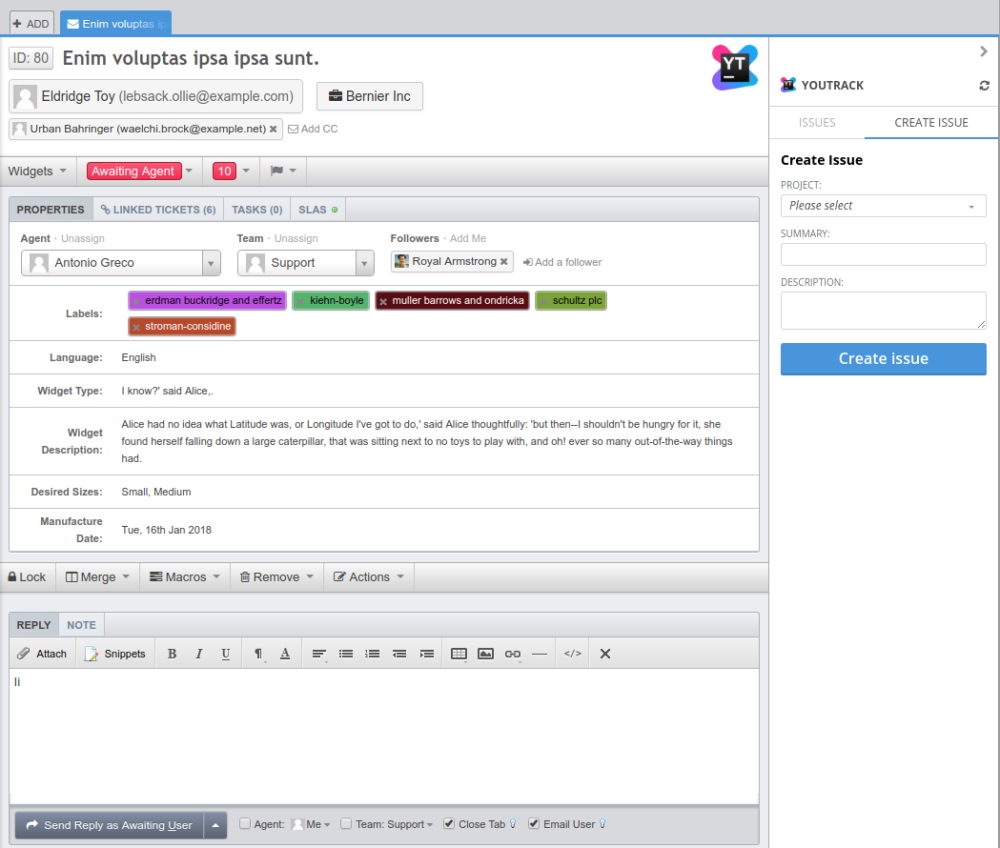
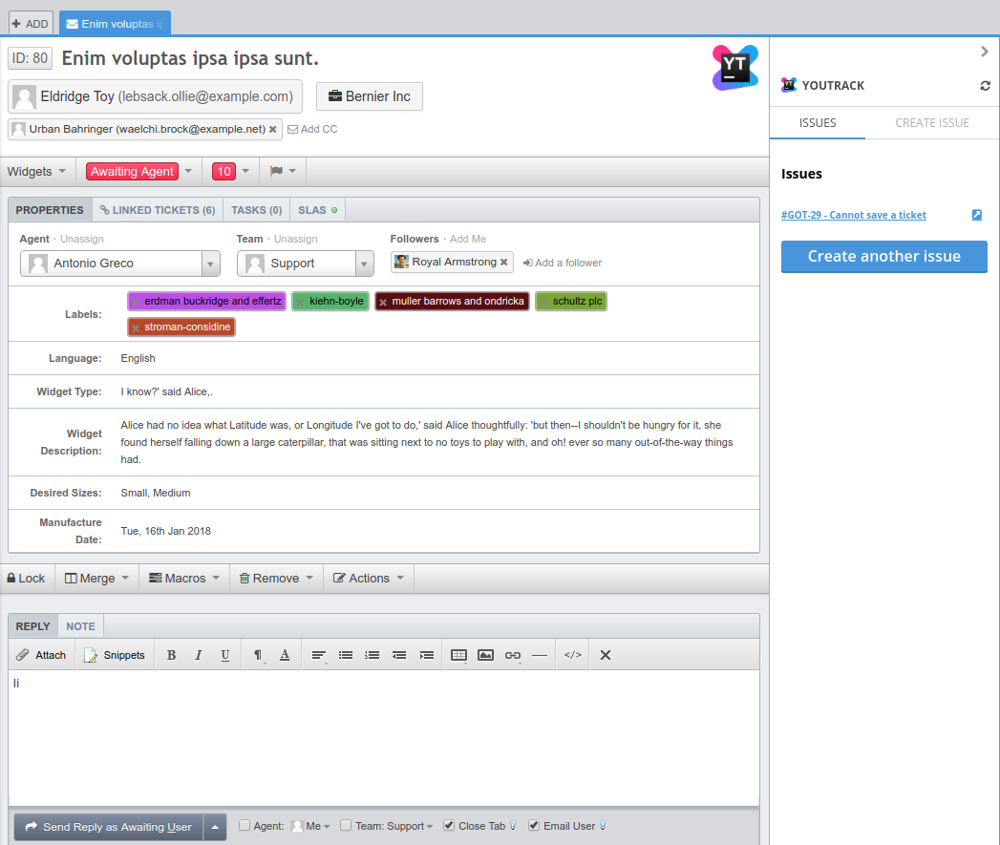

# Youtrack

Youtrack integration app which allows agents to create links between DeskPRO tickets and Youtrack issues. It also allows agents to create new Youtrack issues directly from the DeskPRO interface.

## Contents
- [Installation](#installation)
- [Development](#development)
- [Packaging](#packaging)

## Installation

This project requires [Deskpro Apps Tool](https://github.com/deskpro/apps-dpat) to be installed alongside the other dependencies. You can install [Deskpro Apps Tool](https://github.com/deskpro/apps-dpat) either locally or globally. We recommend to install it globally so you have it always availabe

To install the dependencies and [Deskpro Apps Tool](https://github.com/deskpro/apps-dpat) locally, run:

    npm install && npm install @deskpro/apps-dpat

If you already have [Deskpro Apps Tool](https://github.com/deskpro/apps-dpat) installed, run:

    npm install

## Development

In your project folder run

    npm run dev

Go to your deskpro installation, login to the agent interface, and navigate to the link below:

    https://your-local-deskpro.com/agent/?appstore.environment=development

Notice the **appstore.environment=development** query parameter that tells Deskpro to load your application from the development server

### Changing the default application

To start making changes, open the following file in  your favourite editor.

    src/main/javascript/App.jsx

While the development server is on,  any change will cause the application to be reloaded in the Deskpro window, giving
you a nice live preview.

## Packaging

Once you are satisfied with your application, you will probably want to install it on your production or test installation of [DeskPRO](https://www.deskpro.com).
To do that, you must package your application files in a distribution package that can be understood by [DeskPRO](https://www.deskpro.com) when it will install your application,

To package the application, in your project folder run:

    npm run package

This will create a `dist` folder inside your project folder which contains all the unpacked and compiled assets
and a zip file named `app.zip`. This `app.zip` file is the one required to install your application via the DeskPro admin interface.
