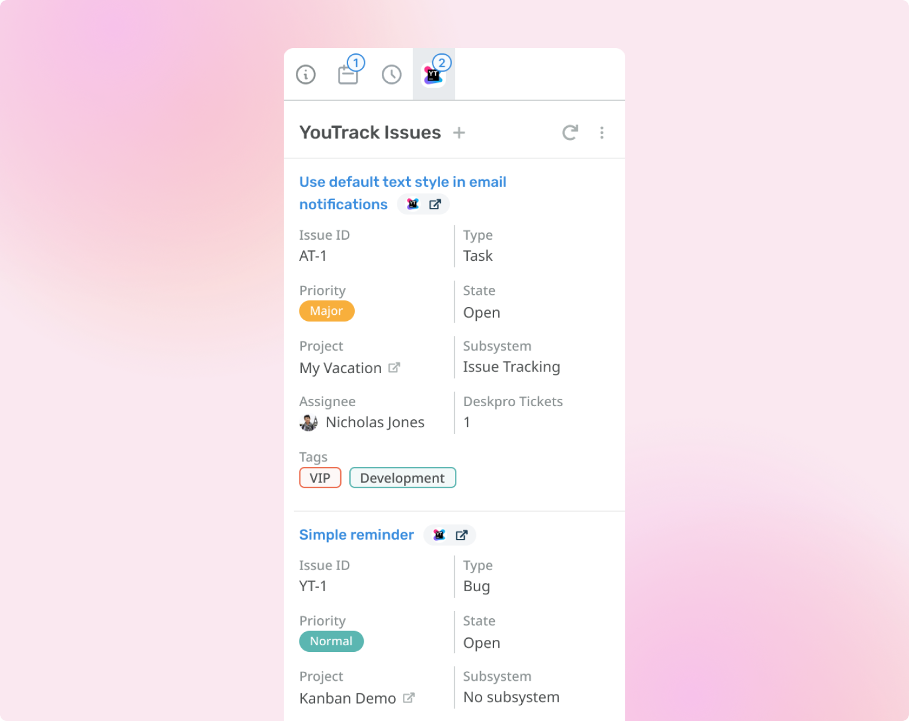

<div align="center">
  <a target="_blank" href=""></a>
  <a target="_blank" href="https://github.com/deskproapps/youtrack/issues"></a>
  <a target="_blank" href="https://github.com/deskproapps/youtrack/blob/master/LICENSE.md"></a>
  <a target="_blank" href="https://github.com/deskproapps/youtrack/releases"></a>
  <a target="_blank" href="https://www.linkedin.com/company/deskpro"></a>

  
</div>

<div align="center">
  <h1>YouTrack App</h1>
  <p>View your YouTrack issues linked with Deskpro tickets to streamline communication with users.</p>
  <a href="https://support.deskpro.com/ga/guides/developers/anatomy-of-an-app" target="_blank">Deskpro Apps Documentation</a>
  <span>&nbsp;&nbsp;•&nbsp;&nbsp;</span>
  <a href="https://www.jetbrains.com/help/youtrack/devportal/youtrack-rest-api.html" target="_blank">YouTrack API Documentation</a>
  <span>&nbsp;&nbsp;•&nbsp;&nbsp;</span>
  <a href="./SETUP.md" target="_blank">YouTrack App Setup Guide</a>
  <br />
  <hr />
  <br />
</div>



## **About the app**
YouTrack lets you track project progress in an agile workflow environment. With Deskpro's YouTrack integration, you can ensure Agents are aware of your development and projects with visibility of issues.

## **Setting up the app in Deskpro**
You can follow our [setup guide](./SETUP.md) for a step-by-step guide to setting up the YouTrack app in Deskpro.

## Development

### With DevContainers (Recommended)
To make development easier and avoid version conflicts, we recommend using **DevContainers** for local development. This approach ensures that everyone on the team uses the same environment, reducing setup issues and version mismatches between dependencies.

#### Why use DevContainers?
- **Consistency:** All developers work in the same environment, with the same versions of dependencies, tools, and configurations.
- **Speed:** The DevContainer setup is quick to start, letting you focus on coding rather than environment setup.
- **Isolation:** Avoid conflicts between different versions of Node.js, PNPM, or other dependencies by using the predefined container setup.

#### Getting Started with DevContainers
1. Ensure that you have [Docker](https://www.docker.com/get-started) and [VS Code](https://code.visualstudio.com/) installed.
2. Open the project in [VS Code](https://code.visualstudio.com/).
3. If you have the **Remote - Containers** extension installed, [VS Code](https://code.visualstudio.com/) should automatically detect the `.devcontainer` configuration in this project and prompt you to reopen the folder in the container.
4. After opening the project in the DevContainer, run:
   ```bash
   pnpm start
   ```

You should now be able to view the app in your browser. For more information about developing [Deskpro apps](https://www.deskpro.com/apps), [Visit the docs](https://support.deskpro.com/ga/guides/developers/anatomy-of-an-app).

### Natively
_We recommend using the DevContainer mentioned above for Consistency, Speed and Isolation._

This app was developed primarily using **Typescript**, **React**, and **Vite**.

#### Setup
To run this project locally:

 ```bash
# Clone the repository
git clone https://github.com/DeskproApps/youtrack.git

# Change to the project directory
cd youtrack

# Install dependencies
pnpm install

# Run the development server.
pnpm start
```

You should now be able to view the app in your browser. For more information about developing [Deskpro apps](https://www.deskpro.com/apps), [Visit the docs](https://support.deskpro.com/ga/guides/developers/anatomy-of-an-app).

### Testing
We've included `jest` to run tests. It will look anywhere in `/src` for test suite files ending in `.test.tsx` or `.test.ts`.

You can run all tests using:

```bash
pnpm test
```

## Versioning
Every app deployment requires that the version property in the `manifest.json` file be updated to reflect the new app version. This is so Deskpro can detect changes and add/upgrade apps accordingly. As such, we've made altering versions easy by having CI make the actual version change for you. Here's what we do:

* We increment patch versions, i.e. 1.0.1, automatically. You don't need to do anything and this will happen
* Minor versions, i.e. 1.1.0, are incremented if you add the minor-version GitHub label to your PR
* Major versions, i.e. 2.0.0, are incremented if you add the major-version GitHub label to your PR

## Top contributors
[](https://github.com/deskproapps/youtrack/graphs/contributors)


## License
Distributed under the MIT License. See [LICENSE.md](LICENSE.md) for more information.
